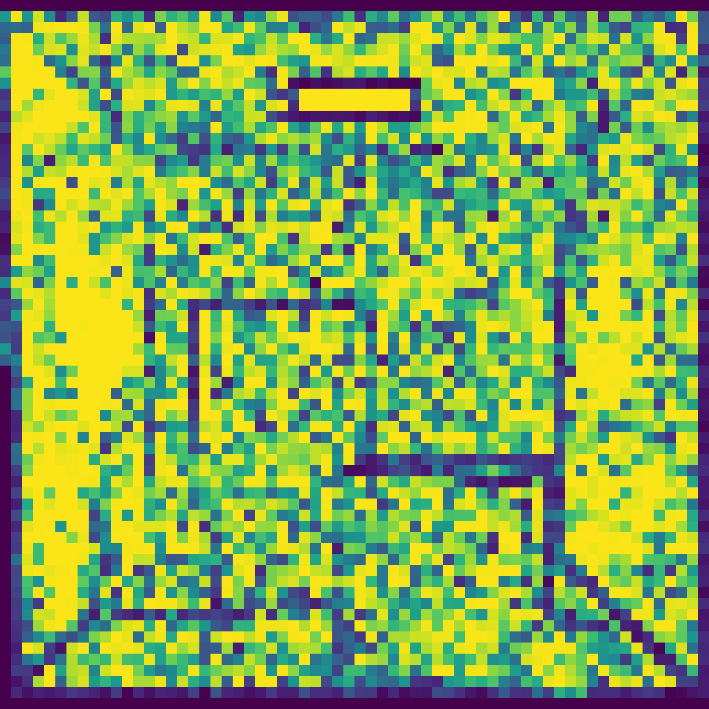
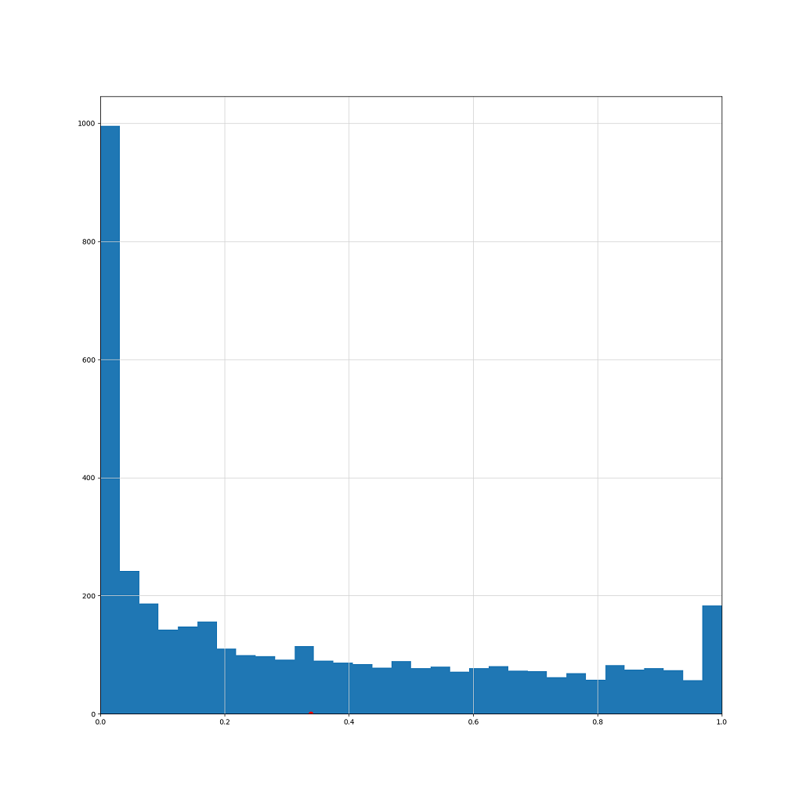

THIS IS AN UNOFFICIAL SAMPLE. IF YOU WANT TO KNOW THE EXACT IMPLEMENTATION, PLEASE REFER TO THE ORIGINAL PAPER[1].

<table>
  <tr>
    <td></td>
    <td></td>
   </tr> 
   <tr>
      <td></td>
      <td></td>
  </td>
  </tr>
</table>

# About

An __UNOFFICIAL__ implementation of "Detecting Bias in Monte Carlo Renderers using Welch’s t-test"[1].

detecting_bias.py: An unofficial version of the official example written in Python.  
cpp/*: A modified version of the official example so that it can be built with CMake.

[1] A. Jung, J. Hanika, and C. Dachsbacher, “Detecting Bias in Monte Carlo Renderers using Welch’s t-test,” Journal of Computer Graphics Techniques (JCGT), vol. 9, no. 2, pp. 1–25, Jun. 2020, [Online]. Available: http://jcgt.org/published/0009/02/01/